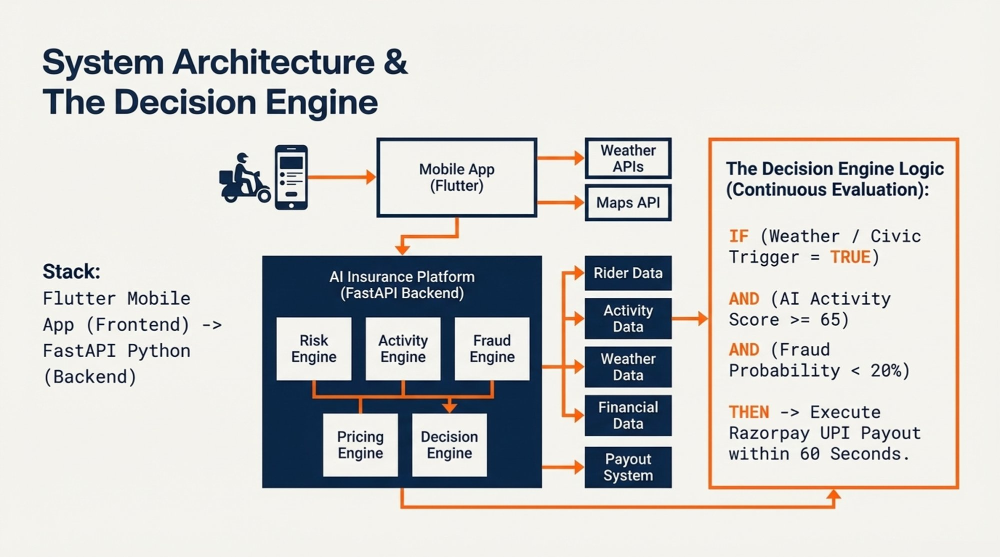

<div align="center">

# ⚡ GigShield

### AI-Powered Parametric Income Protection for Food Delivery Riders


<br>

## 📄 [View Full Project Documentation →](https://razi2528.github.io/GigShield-AI-powered-parametric-insurance-platform/README.html)

<br>

</div>

---

## What is GigShield?

India has 3 million active food delivery riders on Zomato and Swiggy. On any day with heavy rain, a curfew, or a platform outage, every one of them loses income with zero recourse. No insurance product in India has ever addressed this.

**GigShield is the first AI-powered parametric insurance platform built specifically for food delivery riders.** When a disruption occurs, the platform detects it automatically, verifies the rider was genuinely working using a multi-signal AI model, and initiates a UPI payout — without the rider filing any claim, uploading any document, or taking any action.

---

## The Core Problem

| Problem | How GigShield Solves It |
|---------|------------------------|
| Riders lose 20–30% of monthly income to disruptions | Parametric payout triggered automatically on event detection |
| No insurance product covers gig worker income loss in India | First purpose-built parametric product for this segment |
| Traditional claims require documents and days to settle | No claims process — payout is automatic, not requested |
| Monthly premiums don't match weekly income cycles | Weekly subscription priced at ₹79–₹199 aligned to earnings cadence |

---

## How It Works

```
Rider subscribes (4-min onboarding)
        ↓
Flutter app passively monitors GPS, network, accelerometer,
and ambient environment in the background
        ↓
Disruption detected via weather / civic / platform APIs
        ↓
AI verifies rider was genuinely working (multi-signal model)
        ↓
4-gate decision engine evaluates all conditions simultaneously
        ↓
Razorpay UPI payout initiated → WhatsApp confirmation sent
─────────────────────────────────────────────────────────
Total time from trigger to payout: < 60 seconds
```

---

## What We Cover

**Environmental:** Heavy rain · Extreme heat · Flooding · Severe AQI · Cyclone alerts

**Civic:** Unplanned curfews · Section 144 orders · Local bandhs · Sudden market closures

**Platform:** Zomato / Swiggy outages during peak earning windows

---

## Pricing

| Risk Tier | Weekly Premium | Coverage |
|-----------|---------------|----------|
| 🟢 Low Risk | ₹79 | ₹600 |
| 🔵 Medium Risk | ₹119 | ₹600 |
| 🟠 High Risk | ₹179 | ₹600 |
| 🔴 Surge (active alert) | ₹199 | ₹600 |

Premiums are personalised by a hybrid AI risk model that combines 60% historical disruption data with 40% 7-day forecast data to produce a dynamic weekly disruption risk score per zone.

---

## The Hybrid Risk Formula

```
( 0.6 × Historical Risk Score ) + ( 0.4 × Forecast Risk Score )
= Final Disruption Risk %

Example:
Historical pin-code risk: 15%
7-day storm forecast risk: 25%
─────────────────────────────────────────────────────────────
(0.6 × 15) + (0.4 × 25) = 19% Final Disruption Risk

Premium = 19% × ₹600 coverage cap × 1.30 margin = ~₹148 base
AI modifiers: zone multiplier × seasonal loading − loyalty discount
Final output clamped: floor ₹49 — ceiling ₹249
```

---

## Tech Stack

| Layer | Technology |
|-------|-----------|
| Mobile App | Flutter (Android + iOS) |
| Backend | FastAPI (Python) |
| AI / ML | XGBoost · scikit-learn · TensorFlow · SHAP |
| Database | PostgreSQL + Redis |
| Payments | Razorpay UPI Sandbox |
| Notifications | WhatsApp Business API |
| Data APIs | OpenWeather · CPCB · IMD · Google Maps |
| Hosting | AWS EC2 / Render |

---

## System Architecture



**Decision Engine Logic:**
```
IF   (Weather / Civic Trigger = TRUE)
AND  (AI Activity Score >= 65)
AND  (Fraud Probability < 20%)
AND  (Zone Order Volume Drop >= 35%)
THEN → Execute Razorpay UPI Payout within 60 seconds
```

---

## Adversarial Defense

GigShield uses a two-tier fraud architecture. The device layer defeats opportunistic individual fraud. The system layer defeats coordinated syndicate attacks.

**Device Layer — Passive Sensor Verification**

Three independent physical signals collected passively by the Flutter app:

- **Network type check** — `navigator.connection` API detects whether the device is on mobile data or home Wi-Fi
- **Accelerometer pattern** — `DeviceMotion` API checks for variance consistent with two-wheeler movement vs stationary device
- **Ambient sound level** — Web Audio API measures decibel level only (no recording); delivery zones are measurably louder than residential areas

**System Layer — Cannot Be Spoofed from a Phone**

- **Order volume anchor** — no payout fires without a ≥35% zone-level platform order drop; this signal comes from the platform's servers, not the rider's device
- **Zone velocity circuit breaker** — if claim volume exceeds 3× the 30-day baseline in any 20-minute window, all zone payouts pause automatically
- **Temporal activation spike** — 20+ riders activating in the same zone within 3 minutes triggers a cohort hold
- **Isolation forest baseline** — each rider's claim is compared against their own 90-day behavioural history, not the population average

---

## Business Viability

| Metric | Value |
|--------|-------|
| Total addressable riders | ~3 million (India, 2025) |
| Annualised gross premium at 5% adoption | ~₹928 million |
| Average weekly premium | ₹119 |
| Expected weekly payout per rider | ₹108 |
| Target loss ratio | 70–75% |
| Net margin per policy per week | ₹3 – ₹5 |

---

## Development Timeline

| Phase | Dates | Status |
|-------|-------|--------|
| Phase 1: Ideation and Foundation | Mar 4–20, 2026 | ✅ Complete |
| Phase 2: Automation and Protection | Mar 21–Apr 4, 2026 | 🔄 In Progress |
| Phase 3: Scale and Optimise | Apr 5–17, 2026 | ⏳ Upcoming |

**Phase 1 deliverables completed:**
- [x] Repository created with full documentation
- [x] Persona selection with comparative justification
- [x] Hybrid risk model and premium calculation methodology documented
- [x] Disruption taxonomy (environmental + social)
- [x] Parametric triggers with data sources and thresholds
- [x] Tech stack and system architecture documented
- [x] Adversarial defense and anti-spoofing strategy documented
- [ ] 2-minute strategy video — uploading soon

---

## Full Documentation

For the complete proposal including full hybrid model walkthrough, worked premium calculations, adversarial defense specification, payout schedule, and system design detail:

<div align="center">

## 📄 [View Full Visual README →](https://razi2528.github.io/GigShield-AI-powered-parametric-insurance-platform/README.html)

</div>

---

<div align="center">

**GigShield &nbsp;|&nbsp; Guidewire DEVTrails 2026**

*Built for India's 3 million gig workers*

</div>
